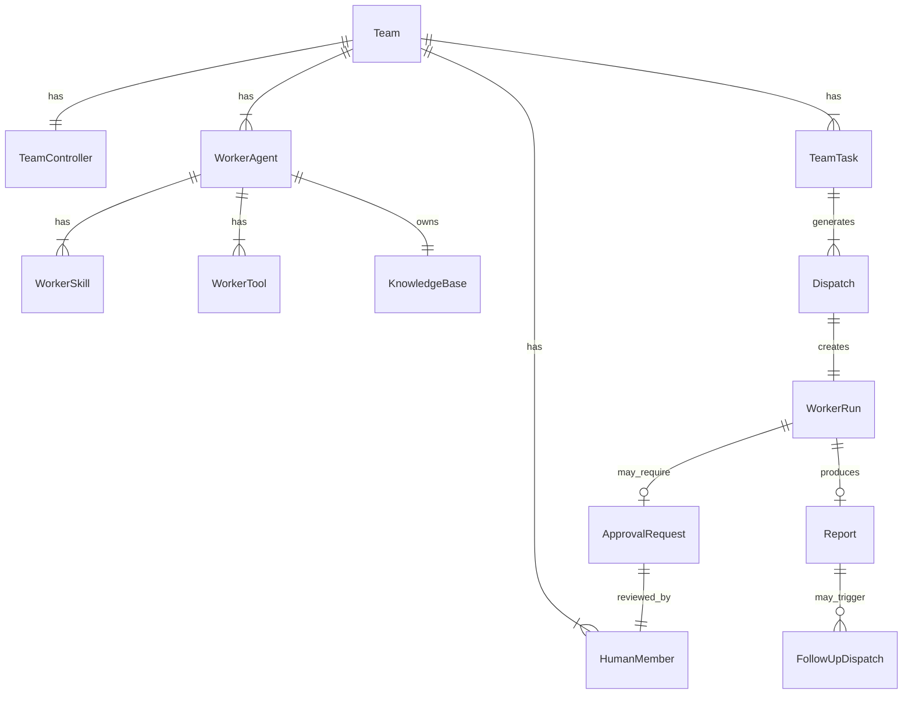
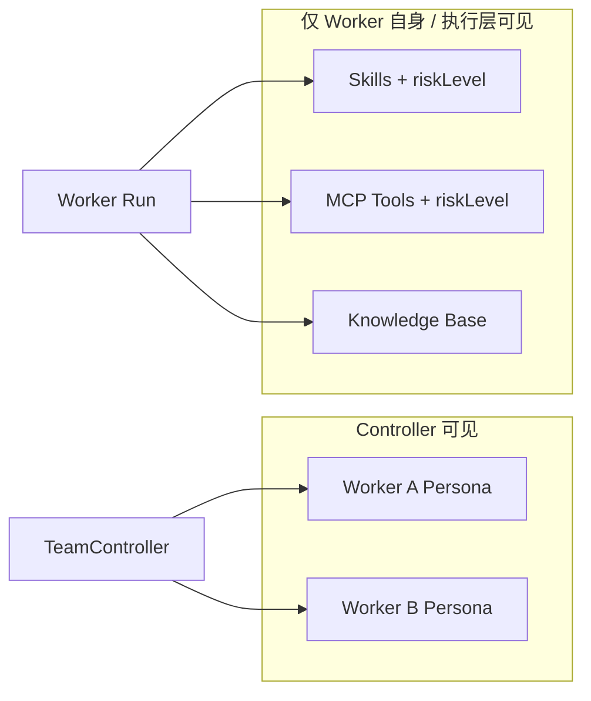
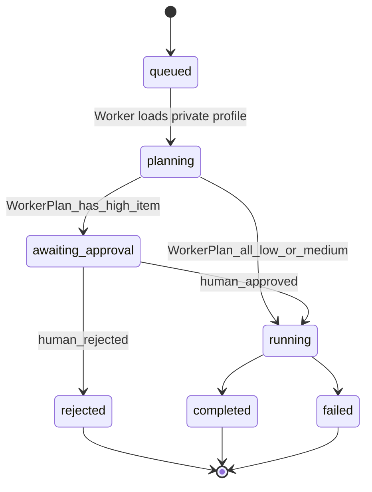
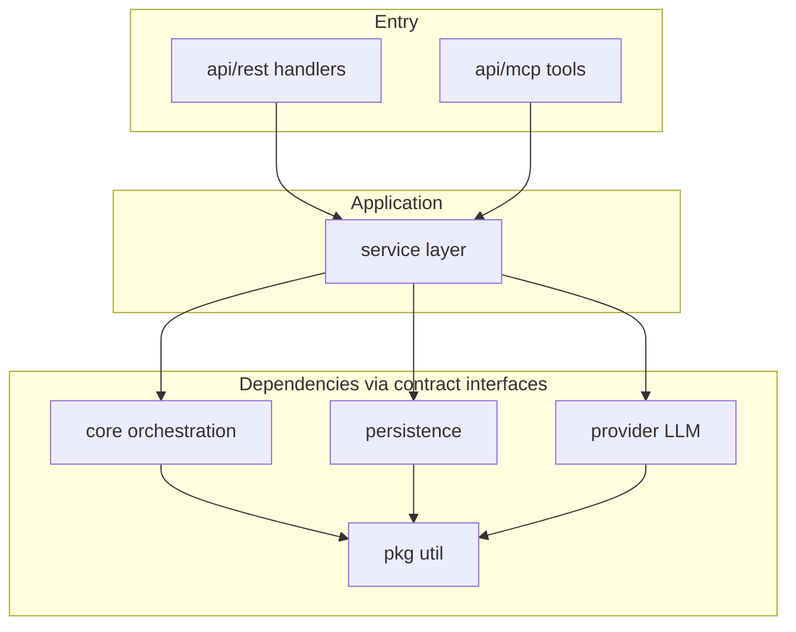
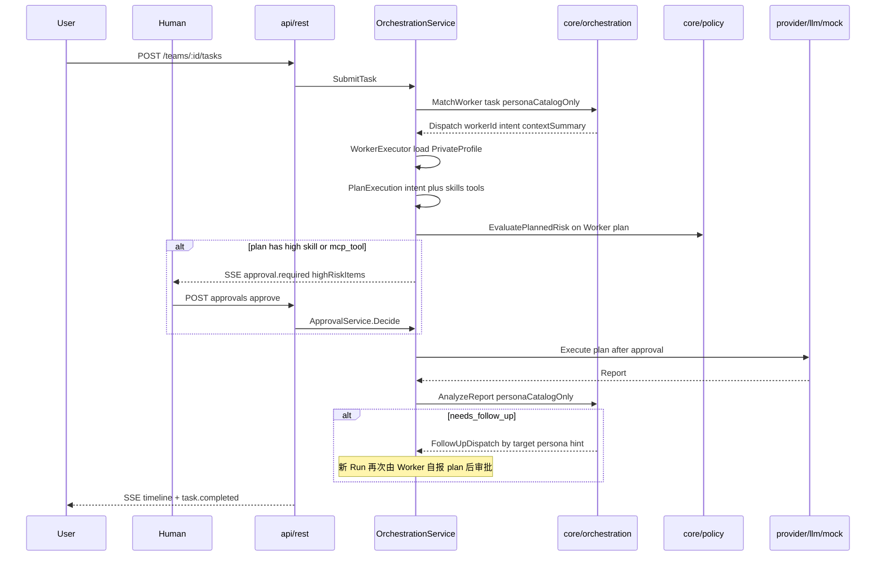
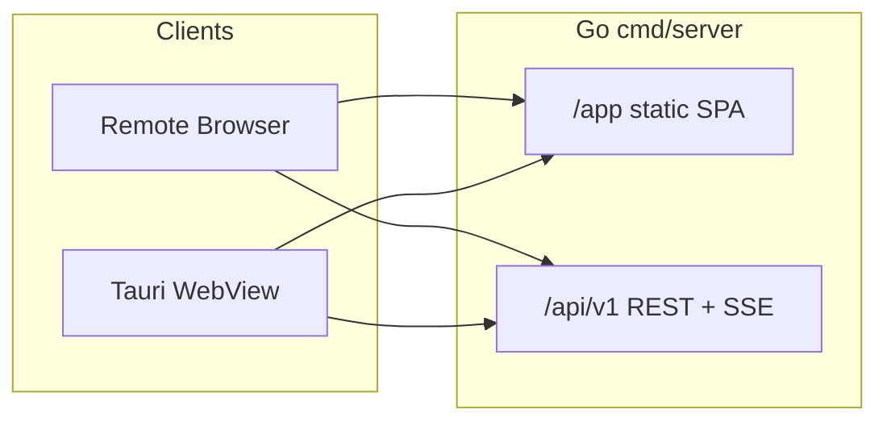

# DanQing-Teams：Agents Teams 协作平台实施计划

## 现状

- [`DanQing-Teams`](/Users/nil.luo/Workspace/coding/DanQing-Teams) 为空目录，无代码、无 git。
- 可复用参考：
  - **Go 分层 + Gin 路由**：[`DanQing-Mail/internal/api/router.go`](/Users/nil.luo/Workspace/coding/DanQing-Mail/internal/api/router.go)
  - **Apple 暗黑主题**：[`DanQing-Studio/frontend/src/styles/theme-apple-*.css`](/Users/nil.luo/Workspace/coding/DanQing-Studio/frontend/src/styles/theme-apple-dark.css)

## 技术选型（已确认）

| 层 | 选型 |
|----|------|
| 后端 | Go 1.22+、Gin、六层架构 + 契约先行 + TDD；首期 memory/mock，预留 SQLite + 远端/本地 LLM |
| 前端 | Vue 3、Vite、TypeScript、Pinia、Element Plus；**仅通过 REST + SSE 与后端通信**（无 Tauri invoke 业务调用） |
| 访问形态 | **Web 浏览器（主路径）**：Go 托管 SPA + `/api/v1`；**Tauri 2（可选壳）**：内嵌同一 SPA，API 指向远端或本机 |
| 主题 | 移植 Studio `theme-apple-dark/native/finish.css`，固定 `html.dark` |

## 核心领域模型

### 三类参与者

| 角色 | 说明 |
|------|------|
| **TeamController Agent** | 理解用户意图；**仅依据各 Worker 的 Persona（人设）** 匹配分派；**不知道** Worker 的技能列表、MCP Tools、知识库明细 |
| **Worker Agent** | 对外仅暴露 Persona 给 Controller；**私有**：技能列表、MCP Tools、知识库；自报本次将使用的 skill/tool；彼此不共享执行上下文 |
| **Human（人类成员）** | Team 内配置；对 **高危操作** 审批（通过/拒绝/附言）；审批前 Worker Run 不得执行副作用 |



### Worker Agent 配置（隔离边界）

每个 Worker 在契约层定义为 **自包含执行包**：

```go
// internal/contract/agent.go
type WorkerAgent struct {
    ID          string
    Name        string
    Persona     string        // 人设：职责边界、说话风格、禁止事项
    Skills      []Skill       // {id, name, description, keywords[], riskLevel} 风险绑在技能上
    Tools       []ToolBinding // 仅本 Worker 可调用的 MCP Tool {toolId, mcpServer, name, riskLevel}
    KnowledgeBase KnowledgeBaseRef // {id, name}；检索经 KnowledgeRetriever，不跨 Worker
}
```

**可见性边界（硬性）**：



- **Controller → Worker**：`Dispatch` 仅含 `workerId`、`intent`、`contextSummary`（无 skillId/toolId）。
- **Worker Run 输入**：`Dispatch` + Worker **私有档案**（Service 按 `workerId` 加载，不经过 Controller）。
- Worker 执行时只能调用 **自己的** MCP Tools；`ToolExecutor` 按 `workerId` 路由。
- **禁止**：`MatchWorker`、`AnalyzeReport`（Controller 路径）读取 `WorkerAgent.Skills` / `Tools` / KB。

**契约拆分**：

```go
// Controller 编排可见
type WorkerPersonaCatalog struct {
    ID      string
    Name    string
    Persona string // 职责描述、边界、擅长领域（自然语言）
}
// 仅 Worker 执行层 / 管理 API 可见（Controller 接口不得返回）
type WorkerPrivateProfile struct {
    WorkerID string
    Skills   []Skill
    Tools    []ToolBinding
    KnowledgeBase KnowledgeBaseRef
}
```

### Controller：仅按 Persona 匹配 Worker

`core/orchestration.MatchWorker` 输入：
- 用户 Task 文本 + 附件元数据
- `[]WorkerPersonaCatalog`（**只有** id、name、persona）

输出 `Dispatch`：`workerId`、`intent`（针对该 Worker 职责的自然语言指令）、`contextSummary`。**不含** `plannedSkillIds` / `plannedToolIds`。

**Demo Seed — Controller 所见人设（示例）**：

| Worker | Persona（Controller 唯一依据） |
|--------|-------------------------------|
| **AlertAnalyst** | 负责告警归因、指标与日志分析、影响评估与止血建议；**不执行**集群变更或生产写操作 |
| **ClusterOperator** | 负责 Kubernetes 集群运维：容量观察、扩容、节点迁移、集群配置变更；变更前须给出计划 |
| **ConfigAuditor** | 负责配置审查、diff、合规检查与回滚建议；以只读分析为主 |

**分派示例（仅 Persona）**：
- 「CPU 飙高 + P1 告警」→ 人设含「告警分析」的 **AlertAnalyst**。
- follow-up「对 prod 执行扩容」→ 人设含「扩容/集群运维」的 **ClusterOperator**（Controller **此时仍不知道** 会用到哪些 MCP Tool）。

### Worker：自选技能与 MCP Tool，再触发审批

Controller 分派后，**Worker 执行阶段**（`service/worker_executor` + `core/worker`）：
1. 加载 `WorkerPrivateProfile`（Skills、Tools、KB）。
2. **`PlanExecution(intent)`** → `ExecutionPlan{skillIds[], toolIds[], rationale}`（首期规则/LLM，**仅 Worker 上下文**）。
3. `policy.EvaluatePlannedRisk(privateProfile, plan)` → 若含 high 技能/MCP Tool → `awaiting_approval`。
4. 审批通过后执行计划并生成 `Report`。

**同一 Worker 内风险仍按技能/MCP Tool 逐项定义**（Controller 不可见，见下节）：

| Worker（私有档案） | Skills（示例） | MCP Tools（示例） |
|-------------------|----------------|-------------------|
| AlertAnalyst | 全部 low | 全部 low |
| ClusterOperator | `cluster.inspect` low；`k8s.scale` **high** | `k8s.nodes.list` low；`k8s.deployment.scale` **high** |

- 仅「列节点」→ Worker 自报 plan 只有 low 项 → **不审批**。
- 「执行扩容」→ Worker 自报 plan 含 high 项 → **审批**（审批单展示 skill/tool 名，非 Worker 名）。

### 人类审批（高危 = 技能或 MCP Tool 级，非 Worker 级）

**核心原则**：**不得**按 Worker Agent 整体标记高危；**仅**当 Worker 自报的 `ExecutionPlan`（或运行时即将调用的 MCP Tool）中某项 `riskLevel=high` 时触发审批。Controller **不参与** 此项判定。

**风险元数据**（配置在 Team 成员档案上，供 `core/policy` 查表）：

```go
type Skill struct {
    ID          string
    Name        string
    Description string
    Keywords    []string
    RiskLevel   RiskLevel // low | medium | high — 每个技能独立标注
}
type ToolBinding struct {
    ToolID      string    // MCP tool 名，如 k8s.deployment.scale
    MCPServer   string    // 如 cluster-ops-mcp
    Name        string
    RiskLevel   RiskLevel // 每个 MCP Tool 独立标注
}
```

**`core/policy` 判定**（纯函数）：

```go
// 输入：本次计划使用的技能/工具 ID；输出：聚合风险 + 触发审批的高危项列表
func EvaluatePlannedRisk(profile WorkerPrivateProfile, plan ExecutionPlan) (max RiskLevel, highRiskItems []RiskItem)
// max = max(匹配到的 Skill.RiskLevel, ToolBinding.RiskLevel)；无 high 则不审批
```

| 聚合 max | 行为 |
|----------|------|
| `low` | Worker 直接执行（含只读 MCP Tool） |
| `medium` | 执行 + Canvas 通知 Human（可选确认，首期可同 low） |
| `high`（**至少一项** skill 或 MCP tool 为 high） | 创建 `ApprovalRequest`，列明 **具体 skillId/toolId**；Run → `awaiting_approval`，**暂停 high 项副作用**；low/medium 项在审批前也不得偷跑 high 绑定 Tool |

**运行时闸门（首期 Mock 可简化，契约预留）**：
- Worker 执行中若 **临时** 要调用未在 `planned` 内、且 `riskLevel=high` 的 MCP Tool → `ToolExecutor` 拦截 → 追加 `ApprovalRequest`（`approval.tool_invoke`）→ 通过后再 `Invoke`。
- 二期：逐步从「Run 级 planned 审批」细化到「每次 MCP Tool 调用前审批」。



- `Team.humanMembers[]`：`{id, displayName, email?, role: approver|observer}`；首期至少一名 `approver`。
- `ApprovalRequest` 字段：`{runId, highRiskItems:[{type:skill|mcp_tool, id, displayName}], summary, status}` — 审批卡片展示 **哪几个技能/工具** 高危，而非「ClusterOperator 高危」。
- `ApprovalService`：仅对 `highRiskItems` 关联副作用放行 → SSE `approval.required` → Human REST 审批。

### 状态枚举

- `TeamTask.status`: `pending` → `dispatching` → `running` → `awaiting_approval`? → `reviewing` → `completed` | `failed`
- `WorkerRun.status`: `queued` → `planning` → `awaiting_approval`?（**Worker 自报 plan 含 high 技能/MCP tool**）→ `running` → `completed` | `failed` | `rejected`
- `ApprovalRequest.status`: `pending` | `approved` | `rejected`
- `Report.intent`: `final` | `needs_follow_up` | `blocked`
- `RiskLevel`：标注在 **`Skill`** 与 **`ToolBinding`（MCP Tool）** 上；Worker Agent **无** 整体 `riskLevel` 字段

## 后端分层架构

### 分层与职责



| 层 | 包路径 | 职责 |
|----|--------|------|
| **API / Handler** | `internal/api/rest`、`internal/api/mcp` | REST 路由与 MCP Tools 适配；解析请求/返回 DTO；**无业务逻辑** |
| **Service** | `internal/service` | Team CRUD、编排、**Approval**、`worker_executor`（加载私有档案→Plan→审批→执行）、SSE |
| **Persistence** | `internal/persistence/...` | DB/缓存；`PersonaCatalog` 与 `WorkerPrivateProfile` 分存或分字段 |
| **Provider** | `internal/provider/llm/...` | 远端/本地 LLM（桩）；Controller 与 Worker 分场景 prompt |
| **Core** | `orchestration`、`worker`、`policy` | Persona 匹配；Worker 自报 plan；Skill+Tool 风险（Controller 不介入） |
| **Util** | `pkg/...` | 无业务语义的公共工具（ID、时间、JSON 校验、错误包装） |

### 依赖规则（硬性）

```
api → service → contract 接口 ← persistence / provider / core
                      ↑
                    pkg（被各层引用，不依赖 internal）
```

- **上层只能依赖下层通过 `internal/contract` 暴露的接口**，禁止 Handler 直调 Repository 或 LLM Client。
- **Core 不依赖** persistence、provider、api；仅依赖 `contract` 领域类型与 `pkg`。
- **Provider / Persistence 互不依赖**；由 `cmd/server` 组装注入 `service`。
- **彻底面向接口 + 依赖注入**：`cmd/server/main.go`（或 `internal/wire`）是唯一 Composition Root。

### TDD 实施顺序（自上而下推理，自底向上实现）

对齐 DanQing-Mail 的 AI-Native 工作流，Teams 采用：

| Round | 产出 | 测试策略 |
|-------|------|----------|
| **R1 契约** | `internal/contract/*.go`：DTO + `TeamRepository`、`TaskRepository`、`LLMProvider`、`Orchestrator`、`EventPublisher` 等 | 编译通过即可 |
| **R2 Core** | `internal/core/orchestration/*_test.go` → 实现匹配/意图/follow-up/隔离摘要 | **纯单元测试**，零 IO |
| **R3 Service** | `internal/service/*_test.go` → 注入 `fake` persistence + `mock` LLM + 真实 core | **表驱动 + fake** |
| **R4 基础设施** | `persistence/memory`、`provider/llm/mock`；`remote`/`local` 仅 **Stub**（返回 `ErrNotImplemented`） | Repository/Provider **契约测试** |
| **R5 API** | `api/rest` handler_test + `api/mcp` tool_test | **httptest 全链路**：从 HTTP/MCP 入口 → service → memory/mock |
| **R6 组装** | `cmd/server` DI  wiring + `test/integration` 冒烟 | 一条 Happy Path + follow-up Path |

**原则摘要**：
- 从最外层 API 用例反推 Service 行为，再反推 Core 纯函数边界。
- 最底层用 **mock/fake** 替代真实 DB 与 LLM，保证 CI 无外部依赖。
- 集成测试从 **入口**（REST `httptest` / MCP tool invoke）跑通全链路，不跳过 Service。

### 目录结构（后端）

```
DanQing-Teams/
├── cmd/server/main.go              # Composition Root：注入各实现
├── internal/
│   ├── contract/                   # 接口 + 跨层 DTO（唯一对外契约）
│   │   ├── team.go
│   │   ├── agent.go          # WorkerAgent, Skill, ToolBinding, KnowledgeBase
│   │   ├── human.go          # HumanMember, ApprovalRequest
│   │   ├── task.go
│   │   ├── llm.go
│   │   ├── knowledge.go      # KnowledgeRetriever 接口
│   │   ├── tools.go          # ToolExecutor 接口（按 workerId 隔离）
│   │   └── events.go
│   ├── api/
│   │   ├── rest/                   # Gin router + handlers + middleware + dto mapping
│   │   └── mcp/                    # MCP Server + Tools 注册
│   ├── service/
│   │   ├── team_service.go
│   │   ├── task_service.go
│   │   ├── orchestration_service.go
│   │   └── approval_service.go
│   ├── persistence/
│   │   ├── memory/                 # 首期：线程安全内存 + 原子操作
│   │   └── sqlite/                 # 预留：GORM/SQLite（二期）
│   ├── provider/
│   │   └── llm/
│   │       ├── mock/               # 首期：规则/模板回复
│   │       ├── remote/             # 远端 OpenAI-compatible API
│   │       └── local/              # ONNX Runtime + Models（桩）
│   └── core/
│       ├── orchestration/          # 仅 Persona 匹配、报告意图、follow-up、context 摘要
│       ├── worker/                 # PlanExecution（自选 skill/tool，Controller 不可见）
│       └── policy/                 # 对 Worker 自报 plan 做 Skill+Tool 风险聚合
├── pkg/
│   ├── id/
│   ├── errs/
│   └── validate/
└── test/integration/               # 全链路集成测试
```

### MCP Tools API（与 REST 等价业务能力）

MCP Server 与 REST **共用同一套 Service**，Tools 为薄适配：

| Tool | 对应 Service | 说明 |
|------|--------------|------|
| `teams_list` | `TeamService.List` | 列出 Teams |
| `teams_get` | `TeamService.Get` | Team 详情含 Controller/Workers |
| `workers_upsert` | `TeamService.UpsertWorker` | 创建/更新 Worker |
| `task_submit` | `TaskService.Submit` | 提交 Team Task，触发编排 |
| `task_timeline` | `TaskService.GetTimeline` | 获取 dispatch/run/report 时间线 |
| `task_cancel` | `TaskService.Cancel` | 取消任务 |
| `approval_list` | `ApprovalService.ListPending` | 待审批列表（Human） |
| `approval_decide` | `ApprovalService.Decide` | 通过/拒绝高危 Run |

MCP 传输：首期 **stdio**（供 Cursor/本地 Agent 调用）；与 Gin **同进程** 或独立 `cmd/mcp` 二选一（推荐同进程注册，共享 DI 容器）。

### Provider 分层（LLM）

```go
// internal/contract/llm.go
type LLMProvider interface {
    Complete(ctx context.Context, req CompletionRequest) (CompletionResponse, error)
}
```

| 实现 | 路径 | 首期 |
|------|------|------|
| Mock | `provider/llm/mock` | 规则匹配 + 模板 Markdown 报告 |
| Remote | `provider/llm/remote` | Stub（HTTP client 结构就绪） |
| Local | `provider/llm/local` | Stub（ONNX Runtime 接口占位） |

`OrchestrationService` 通过 `LLMProvider` 调用 Controller/Worker 推理；**首期 Mock 可绕过 LLM**，Core 规则引擎 + `mock` 模板即可跑通；接口不变，后续切换 Remote/Local。

### Persistence 原子操作约定

- 所有写操作经 Repository 方法，**单实体原子**；跨实体编排状态变更由 `TaskRepository` 提供 `ApplyTransition(taskID, fn)` 或内存层 `mutex` + 事务函数。
- Worker 隔离：`Dispatch` 仅存 `Intent` + `ContextSummary`；KB 按 `knowledgeBaseId` 分表/分 namespace；Tools 绑定表含 `workerId`。
- 审批：`ApprovalRequest` 与 `WorkerRun` 同事务写入；`Decide` 原子更新 Run 状态并发布 SSE。

---

## 编排流程（首期：Core 规则 + Provider Mock）



**首期规则（可替换为 LLM）**：
- **Controller `MatchWorker`**：Task 与各 `Persona` 文本相似度/关键词（告警→AlertAnalyst 人设；扩容/迁移→ClusterOperator 人设）。**禁止读取 Skills/Tools**。
- **Worker `PlanExecution`**：在私有档案内选 skill/tool（首期：意图关键词 ↔ `Skill.Keywords` / `ToolBinding` 描述表，**仅 Worker 模块可访问**）。
- **Follow-up**：`SuggestedAction.targetPersonaHint`（自然语言，如「需要集群运维」）供 Controller 再次 `MatchWorker`；**不使用** `requiredSkillId` 暴露给 Controller。
- **风险**：`policy.EvaluatePlannedRisk(privateProfile, executionPlan)` — 在 Worker 自报 plan 之后执行；Controller 链路永不调用。

**SSE 事件（增补）**：`approval.required`、`approval.approved`、`approval.rejected`。

模拟耗时：Worker 2–5s；审批阻塞直至 Human 操作（集成测试可 mock 自动 approve）。

## 仓库结构（Monorepo）

```
DanQing-Teams/
├── cmd/server/main.go          # Gin + MCP + DI 组装
├── internal/                   # 见「后端分层架构」
├── test/integration/
├── frontend/                   # Vue 3 SPA
│   ├── src/
│   │   ├── layouts/TeamsShell.vue
│   │   ├── components/
│   │   │   ├── left/TeamSidebar.vue, TaskList.vue
│   │   │   ├── center/FloatingCanvas.vue
│   │   │   ├── right/RightDock.vue (Todo|Agents|WorkerSpace tabs)
│   │   │   └── composer/FloatingComposer.vue
│   │   ├── stores/ teams.ts, tasks.ts, agents.ts, workspace.ts
│   │   ├── api/ client.ts
│   │   └── styles/             # 自 Studio 移植 + Teams 专用 token
├── desktop/                    # Tauri 2
│   ├── src-tauri/
│   └── 指向 frontend 构建产物
├── web/dist/                   # 构建产物；Go 托管于 /app（与 Mail 一致）
├── go.mod
└── README.md
```

## REST API 设计（v1）

Base: `/api/v1`，JSON，`Id` 为 UUID 字符串。

### Teams & Agents

| Method | Path | 说明 |
|--------|------|------|
| GET | `/health` | 健康检查 |
| GET | `/teams` | 列表 |
| POST | `/teams` | 创建 `{name, description?}` |
| GET | `/teams/:teamId` | Team 详情；`?view=controller` 时 workers **仅返回** id/name/persona（编排用） |
| PATCH | `/teams/:teamId` | 更新 |
| DELETE | `/teams/:teamId` | 删除 |
| GET | `/teams/:teamId/controller` | Controller persona / systemPrompt |
| PUT | `/teams/:teamId/controller` | 更新人设 |
| GET | `/teams/:teamId/workers` | 管理视图：完整档案；`?view=controller`：**仅** persona 列表 |
| POST | `/teams/:teamId/workers` | `{name, persona, skills[], tools[], knowledgeBase}`（管理面配置，Controller 不读取明细） |
| PATCH | `/teams/:teamId/workers/:workerId` | 更新 persona（Controller 可见）及私有 skills/tools/KB |
| GET | `/teams/:teamId/tasks/:taskId/runs/:runId/plan` | Worker 自报 `ExecutionPlan`（skill/tool 项 + 风险，供 Canvas/审批） |
| DELETE | `/teams/:teamId/workers/:workerId` | 删除 |
| GET | `/teams/:teamId/workers/:workerId/knowledge` | 查询本 Worker KB 文档列表（元数据） |
| PUT | `/teams/:teamId/workers/:workerId/knowledge/docs` | 上传/更新 KB 文档（首期 JSON 块） |

### Human Members & Approvals

| Method | Path | 说明 |
|--------|------|------|
| GET | `/teams/:teamId/humans` | 人类成员列表 |
| POST | `/teams/:teamId/humans` | 添加 `{displayName, role: approver\|observer}` |
| GET | `/teams/:teamId/approvals` | 待审批列表 `?status=pending` |
| GET | `/teams/:teamId/approvals/:approvalId` | 审批详情（含拟执行操作摘要） |
| POST | `/teams/:teamId/approvals/:approvalId/approve` | `{comment?}` 通过并恢复 Run |
| POST | `/teams/:teamId/approvals/:approvalId/reject` | `{comment?}` 拒绝，Run→rejected |

### Tasks & Orchestration

| Method | Path | 说明 |
|--------|------|------|
| GET | `/teams/:teamId/tasks` | 任务列表（`?status=` 过滤） |
| POST | `/teams/:teamId/tasks` | 用户从 Composer 提交 `{content, attachments?}`；**自动触发** Controller 首次 dispatch |
| GET | `/teams/:teamId/tasks/:taskId` | 任务详情 + 当前 phase |
| GET | `/teams/:teamId/tasks/:taskId/timeline` | dispatch / run / **approval** / report / follow-up |
| POST | `/teams/:teamId/tasks/:taskId/cancel` | 取消进行中的 runs |
| GET | `/teams/:teamId/tasks/:taskId/stream` | **SSE** 实时事件 |

### Reports & Workspace

| Method | Path | 说明 |
|--------|------|------|
| GET | `/teams/:teamId/tasks/:taskId/reports` | 全部 Worker 报告 |
| GET | `/teams/:teamId/tasks/:taskId/reports/:reportId` | 单报告 Markdown |
| GET | `/teams/:teamId/workspace` | Canvas 产物列表 |
| POST | `/teams/:teamId/workspace/artifacts` | 手动 pin 产物（Mock 可由 report 自动生成） |

### Todos（右侧面板）

| Method | Path | 说明 |
|--------|------|------|
| GET | `/teams/:teamId/todos` | `?taskId=` |
| POST | `/teams/:teamId/todos` | 创建 |
| PATCH | `/teams/:teamId/todos/:todoId` | 完成/更新 |

### 示例 DTO（核心字段）

```go
// internal/contract/task.go
type Dispatch struct {
    ID             string `json:"id"`
    TaskID         string `json:"taskId"`
    WorkerID       string `json:"workerId"`
    Intent         string `json:"intent"`
    ContextSummary string `json:"contextSummary"`
    Round          int    `json:"round"`
    // 无 plannedSkillIds/plannedToolIds — Controller 不可见
}
type ExecutionPlan struct {
    RunID           string   `json:"runId"`
    SkillIDs        []string `json:"skillIds"`
    ToolIDs         []string `json:"toolIds"`
    Rationale       string   `json:"rationale"` // Worker 自述选用理由
    EvaluatedRisk   RiskLevel `json:"evaluatedRisk"`
    HighRiskItems   []RiskItem `json:"highRiskItems,omitempty"`
}
type SuggestedAction struct {
    Description        string `json:"description"`
    TargetPersonaHint  string `json:"targetPersonaHint"` // Controller 仅据此匹配下一 Worker
}
```

**Seed 数据**：Demo Team「SRE 作战室」— 三 Worker 各带 **分级** Skills + MCP Tools；Human `approver`；演示任务：告警分析（全 low，无审批）→ follow-up 扩容（仅 `k8s.scale` + `k8s.deployment.scale` 触发审批）。

## 前端与后端通信（REST 优先，支持远程浏览器）

### 原则

- 前端 **零业务直连**：所有数据与动作经 **`/api/v1/*` REST**；实时更新经 **HTTP SSE**（`GET .../tasks/:id/stream`），不使用 WebSocket、不通过 Tauri Command 调后端逻辑。
- 前端为 **纯 SPA**：与后端仅通过网络边界交互，同一份 `frontend/dist` 可用于本机、局域网、公网浏览器。
- **MCP Tools** 供外部 Agent（如 Cursor）调用，**不**供 Vue 前端使用；前端只走 REST。



### API Base URL 配置

| 场景 | `VITE_API_BASE_URL` | 说明 |
|------|---------------------|------|
| 生产/远程浏览器 | `""`（空，相对路径） | 页面由 Go 从 `/app` 提供，API 同源 `/api/v1`，无 CORS 问题 |
| 前端 dev + 远端 API | `http://192.168.x.x:8080` | Vite proxy 或直连；后端 `CORS` 允许 dev origin |
| Tauri 桌面 | `http://127.0.0.1:8080` 或用户配置的服务器地址 | 壳内 WebView 加载 SPA，API 指向已部署的 Go 服务 |

实现要点（`frontend/src/api/client.ts`）：
- `const base = import.meta.env.VITE_API_BASE_URL ?? ''`
- 统一 `fetchJson`、`streamEvents`（EventSource URL 含 base）
- Pinia stores **禁止** import `internal/*` 或假设同进程

### Go 服务端托管（对齐 DanQing-Mail）

[`router.go` 模式](/Users/nil.luo/Workspace/coding/DanQing-Mail/internal/api/router.go)：

- `GET /` → 302 → `/app/`
- `Static("/app", "./web/dist")` 或构建时复制 `frontend/dist` → `web/dist`
- `Group("/api/v1")` 全部 REST + SSE
- `middleware.CORS()`：允许配置 `ALLOWED_ORIGINS`（dev 用 `*`，生产可收紧）
- `Listen` 默认 `0.0.0.0:8080`，便于局域网/远程浏览器访问

### 运行模式

| 模式 | 启动方式 | 访问 |
|------|----------|------|
| **A. 远程/本机浏览器（推荐验收）** | `go run ./cmd/server` + `npm run build` | `http://<host>:8080/app/` |
| **B. 前端热更开发** | `vite` + 并行 `go run` server | 浏览器 `localhost:5173`，API 指 `8080` |
| **C. Tauri 桌面** | `tauri dev` / `tauri build` | 窗口内 WebView；API 同模式 A/B |

---

## 前端 UI 架构

### 布局（Agent IDE 壳层）

```
┌──────────────────────────────────────────────────────────────┐
│  [可选] 顶栏 44px：Team 名 / 连接状态                         │
├──────────┬───────────────────────────────────────┬───────────┤
│ Teams    │                                       │ RightDock │
│ Tasks    │     FloatingCanvas (glass, 12px r)    │ ┌───────┐ │
│ 240px    │     - 任务流 / 报告 / **审批卡片**     │ │Todo   │ │
│ glass    │     - 高危：批准/拒绝 + 操作摘要       │ │Agents │ │
│ panel    │                                       │ │Worker │ │
├──────────┴───────────────────────────────────────┴───────────┤
│  FloatingComposer (bottom 24px inset, max-w 720px, centered)   │
│  - 多行输入 + 附件占位 + 发送                                    │
└────────────────────────────────────────────────────────────────┘
```

### Apple 暗黑像素规范（移植 + 扩展）

从 Studio 复制并增加 Teams token（`frontend/src/styles/`）：

- 页面底 `#000000`，面板 `#1c1c1e`，浮层 `#2c2c2e` + `backdrop-filter: blur(20px) saturate(180%)`
- 主色 `#0a84ff`，分隔线 `rgba(255,255,255,0.1)`
- 圆角：面板 12px、Composer 14px、按钮 10px
- 字体：`-apple-system` 栈；字号 13/15/17 三级
- 交互：按压缩放 `transform: scale(0.98)`、120ms ease；Composer focus ring 蓝色 2px 外发光
- EP 组件：仅覆盖 Input、Button、Tabs、Scroll、Drawer 为 native 观感

### 前端模块与 API 联动

| 区域 | 组件 | Store / API |
|------|------|-------------|
| 左 | `TeamSidebar`, `TaskList` | `teams.ts` → GET/POST teams, tasks |
| 中 | `FloatingCanvas` | timeline：dispatch → **ExecutionPlan** → approval → report |
| 右 | `RightDock` | Agents：Worker 完整档案（skills/tools/KB）；Controller 页**仅** Persona；审批待办 |
| 中 | `ApprovalCard` | 列出 **高危技能/MCP Tool 名称** + 操作摘要；非 Worker 名称 |
| 底 | `FloatingComposer` | POST tasks → 订阅 SSE 刷新 |

**SSE 客户端**：`api/stream.ts` 使用与 REST 相同的 `VITE_API_BASE_URL` 拼接待订阅 URL；断线指数退避重连。

## Tauri 集成（可选壳，非第二套前端）

- Tauri **不承载业务 API**；WebView 仅加载 SPA（dev：`5173`；release：打包 `frontend/dist` 或远程 `https://your-server/app/`）。
- `tauri.conf.json` CSP/connect 允许配置的 API 源（`localhost:8080` 及部署域名）。
- 设置页（二期可选）：用户填写「服务器地址」，写入 `localStorage` 覆盖 `VITE_API_BASE_URL`，便于桌面客户端连接远程 Teams 服务。
- 窗口：默认 1280×800，macOS `titleBarStyle: Overlay`。

**与浏览器关系**：Tauri = 原生窗口 + 同一 REST 客户端；远程值班可通过浏览器打开同一后端，无需安装桌面端。

## 实施阶段

### Phase 1 — 脚手架 + 契约（~1d）
- `go mod init`，目录骨架（六层 + `pkg` + `test/integration`）
- **R1** `internal/contract` 全部接口与 DTO
- `cmd/server` DI 骨架 + **静态托管 `/app` + CORS + `0.0.0.0:8080`**
- `frontend`（`api/client` 基址可配置）/ `desktop` / README（含浏览器远程访问说明）/ `.gitignore`

### Phase 2 — 后端 TDD 全链路（~1.5d）
- **R2** `core/orchestration` 单元测试 → 实现
- **R3** `service` + fakes 表驱动测试 → 实现
- **R4** `persistence/memory` + `provider/llm/mock`；remote/local Stub
- **R5** `api/rest` REST + SSE；`api/mcp` Tools；httptest 集成测试
- Seed Demo Team；`test/integration` 冒烟

### Phase 3 — 前端壳层与联调（~1.5d）
- `TeamsShell` 四区布局 + 响应式（窄屏折叠左右栏）
- 各面板 CRUD + Task 提交流
- Canvas 时间线卡片（dispatch / running / report）
- SSE 驱动状态徽章与自动滚动

### Phase 4 — 打磨（~0.5d）
- 空状态、加载骨架、错误 Toast（EP Message）
- Worker Space：仅展示当前 Run 的 intent/context + **本 Worker** 的 Skills/Tools/KB 摘要（无跨 Worker 数据）
- Canvas **ApprovalCard**：高危待审；右栏 Agents 支持编辑 Worker 四维配置
- 键盘：Composer `Cmd+Enter` 发送

## 二期预留（本期不做）

- `persistence/sqlite` 替换 memory；迁移脚本
- `provider/llm/remote` 真实 HTTP；`provider/llm/local` ONNX Runtime 推理
- Worker 并行上限、真实 Tool 执行器（对接 K8s/告警 API）
- 画布富文本协同编辑

## 验收标准

1. **架构**：`go test ./...` 全绿；无 Handler 直调 persistence/provider；Core 包无 `gin`/`database` 依赖。
2. **TDD**：`core/orchestration` 单测不含 Skills/Tools fixture；`core/worker` + `core/policy` 测 plan 与审批；集成测试 **Persona 分派 → Worker 自报 plan → 高危 tool 审批 → 执行**。
3. **可见性**：Controller 编排路径仅接收 `WorkerPersonaCatalog`；Skills/Tools/KB 不出现在 `MatchWorker`/`AnalyzeReport` 入参；Worker 私有档案仅 `worker_executor` 加载。
4. **隔离**：Worker A 的 KB/Tools 不可被 Worker B 引用；审批依据 Worker 自报 `ExecutionPlan` 中的 high 技能/MCP Tool。
5. **审批**：Worker `PlanExecution` 后若 plan 含 high 技能/MCP Tool 才等待审批；`ApprovalCard` 展示 plan 中的 skill/tool 项。
6. **产品**：Agents 面板编辑完整档案；Controller 配置页**仅** Persona；Canvas 展示 `ExecutionPlan` + 审批卡片。
7. **MCP/API**：`approval_*` Tools 与 REST 一致；SSE 含 `approval.*`、`run.plan_ready` 事件。
8. **远程浏览器**：另一台机器访问 `http://<server-ip>:8080/app/` 可完成 Team/Task/审批全流程；前端无 Tauri 专属 API 依赖。
