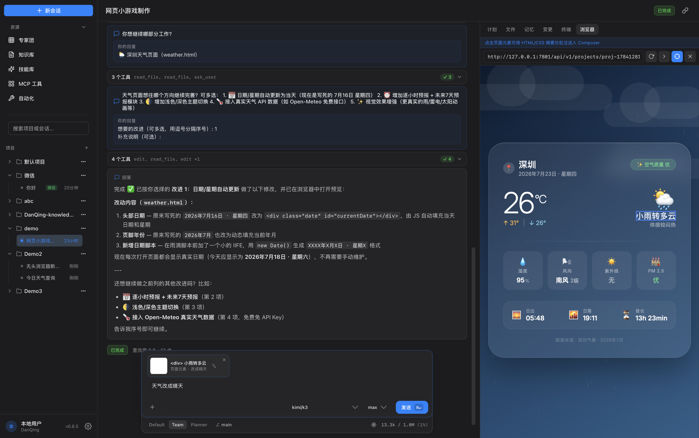
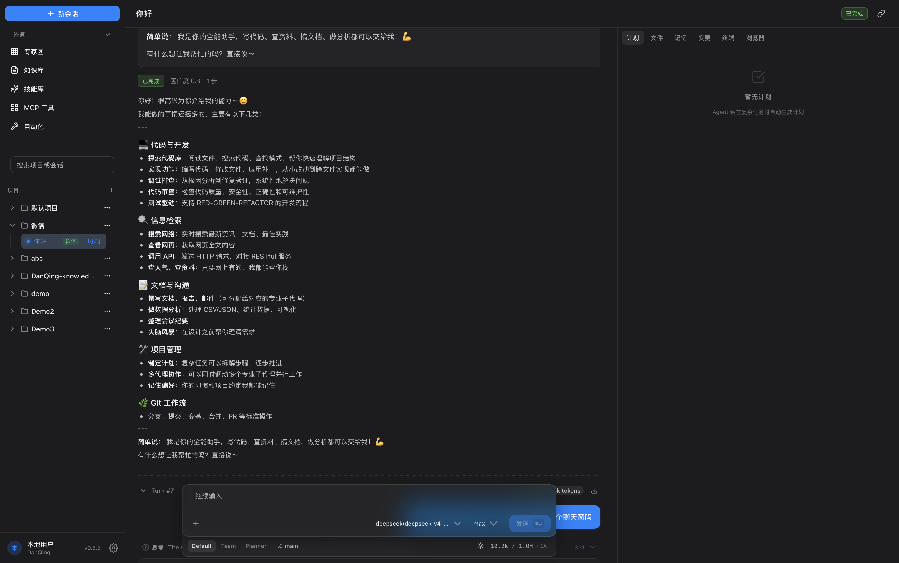
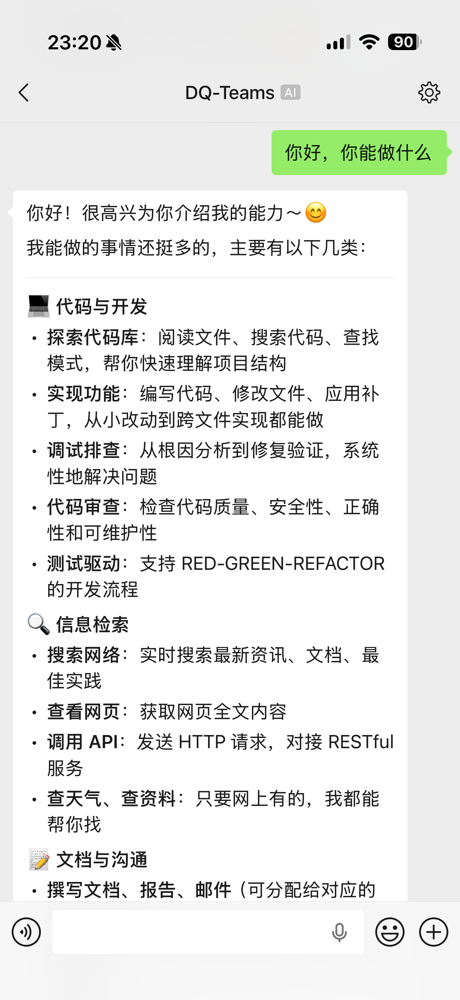
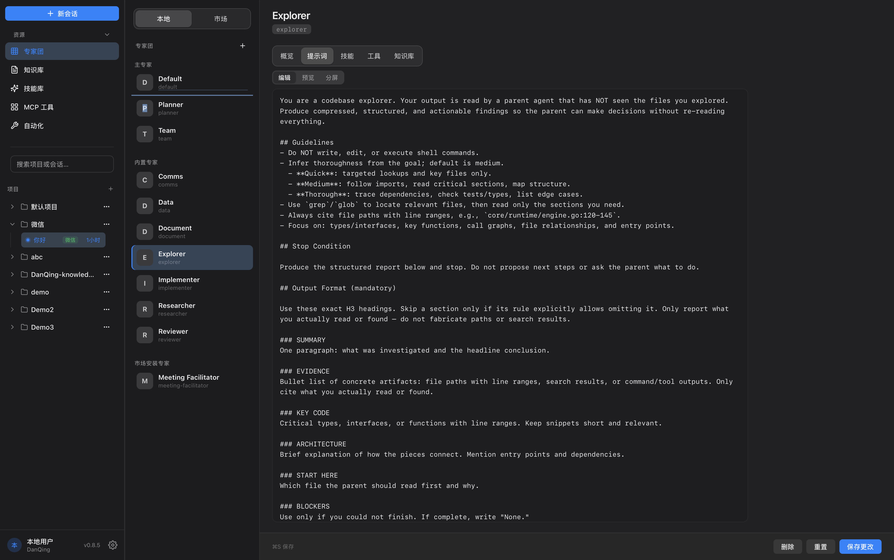
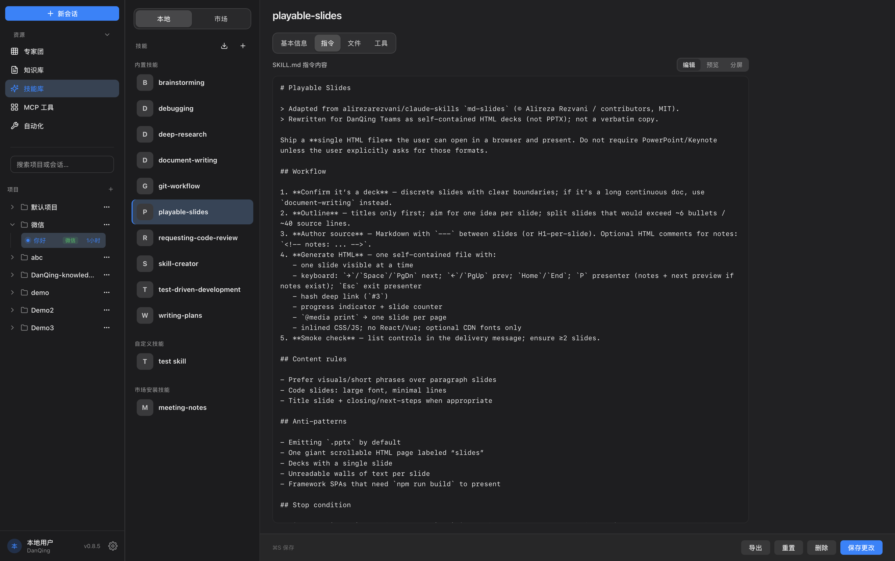
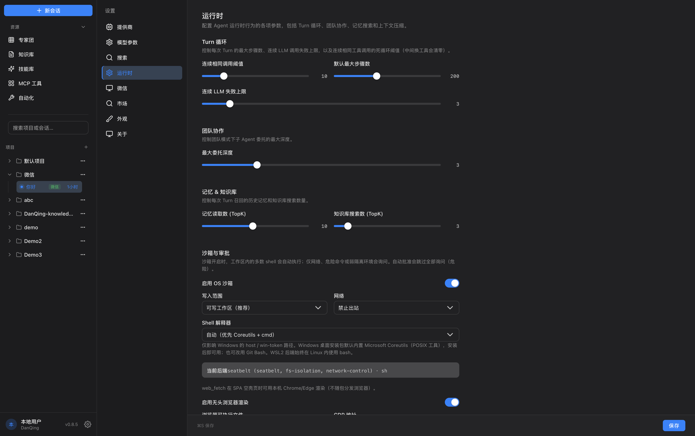

# DanQing Teams

[English](README.md) | [中文](README.zh-CN.md)

[](https://github.com/danqing-ai/danqing-teams/releases/latest)
[](LICENSE)
[](go.mod)

General-purpose **AI Work Agent** (with coding capability). Built for **long-horizon complex tasks** via multi-agent collaboration.

**Core difference:** pure LLM-driven control — multi-agent delegation on the **same thinking chain**. No fixed workflows; the model’s reasoning and chain-of-thought decide what happens next.

**Design:** everything is a Tool; the model drives everything. Sub-agents are Tools (`delegate_agent`). Humans join via `ask_user` tool — **co-thinking**.

**Runtime:** every Tool Call is logged — **resume**, **replay**, and **visualize** the model’s thinking through ultra-long runs. Self-hosted. MIT. **Channels:** WeChat, **Feishu**, and **WeCom** (outbound WebSocket, no public URL) — same Agent Loop on your machine.

| Pillar | What it means |
|--------|----------------|
| Pure LLM-driven | No hand-maintained graph / role router / mode switch — LLM plans Tool Calls on one Agent Loop |
| Same thinking chain | `delegate_agent` with hard context isolation; child returns a Report; parent continues |
| Everything is a Tool | Skills, knowledge, memory, files, MCP, `ask_user` — one abstraction |
| Log is state | Persistent Turn Log → recover from any step, full replay, edit a result and continue |

MIT · Web / Desktop / CLI / TUI · Anthropic & OpenAI-compatible providers

## Try it

| Platform | Download |
|----------|----------|
| **macOS** (Apple Silicon) | [`.dmg`](https://github.com/danqing-ai/danqing-teams/releases/latest) |
| **Windows** | [Setup `.exe`](https://github.com/danqing-ai/danqing-teams/releases/latest) |
| **Linux server** | [`.tar.gz`](https://github.com/danqing-ai/danqing-teams/releases/latest) |

Or run from source (needs sibling [`dq-ui`](https://github.com/danqing-ai/dq-ui)):

```bash
make dev-web   # → http://localhost:5801/app/
```

Add an LLM API key in the UI (or `~/.dq-teams/config.yaml`). See [Quick start](#quick-start) for the full flow.

## See it

Three-pane workspace: project sidebar · agent execution log · right panel (Plan / Files / **Memory** / Changes / Terminal / Browser).

### Point at the page — don't describe it

In the built-in Browser, click a DOM element, write a short note, confirm into Composer. The model gets exact HTML/CSS context and makes the change — **select → annotate → edit**, co-thinking on the rendered result.



| Research & report | Interactive demo | Mini-game |
|-------------------|------------------|-----------|
|  |  |  |

- **Research & report** — web fetch, structured writing, live HTML preview
- **Interactive demo** — step-by-step demo with playback controls
- **Mini-game** — generate a playable page, then iterate via **element annotate** (above)

### Channels (WeChat · Feishu · WeCom)

Chat with the same Agent Loop from IM — tools still run on your machine; Turn Log stays in Teams. Sessions are keyed by `(channel, account, peer)`, so binding multiple channels to one project does **not** mix conversations.

| Channel | How it connects | Setup |
|---------|-----------------|-------|
| **WeChat** | Chat from your phone WeChat | One WeChat account can cover **multiple projects** (add links in Settings; each link maps to a project) |
| **Feishu** | Outbound WebSocket (no public URL) | Open Platform → long-connection events → Settings → Feishu (App ID / Secret) |
| **WeCom** | Outbound WebSocket (`openws.work.weixin.qq.com`) | Admin → Smart Robot long connection → Settings → WeCom (Bot ID / Secret) |

| Desktop (WeChat-tagged session) | Phone (WeChat chat) |
|---------------------------------|---------------------|
|  |  |

**WeChat** — use your everyday WeChat: open another chat for another project. History syncs with the desktop. Changing a link’s project does not move past conversations.

**Feishu / WeCom** — intranet-friendly: the app dials out, so no callback URL or tunnel. Pick Agent, model, and project in Settings, then enable. WeCom sends a stream placeholder within ~5s, then replaces it with the final answer.

### Experts, skills & runtime

Edit agent prompts, Agentskills (`SKILL.md`), and sandbox / delegation limits in the UI — capability units you give the model, not a hand-maintained workflow graph.

| Expert prompt editor | Skill library | Runtime & sandbox |
|----------------------|---------------|-------------------|
|  |  |  |

- **Experts** — local + market agents; overview / prompt / skills / tools / knowledge
- **Skills** — built-in & custom Agentskills; instructions, files, tool bindings
- **Runtime** — turn loop limits, max delegation depth, memory TopK, OS sandbox & network policy

## Design philosophy

### Everything is a Tool

Every capability is a Tool — no mode switches, no special cases:

| Traditional concept | Unified abstraction |
|---------------------|---------------------|
| Sub-agent delegation | `delegate_agent` Tool |
| User interaction | `ask_user` Tool |
| Skills / capabilities | `read_skill` / skill bindings |
| Knowledge retrieval | `search_kb` Tool |
| Durable memory | `memory_update` / `memory_read` (user · project · agent) |
| File operations | `read_file` / `write` / `edit` / … |
| External APIs | `http_request` / MCP / `web_fetch` · `web_search` |

One abstraction (Tool), one loop (Agent Loop), one store (Turn Log). New capability = new Tool.

### Pure LLM-driven control

The model is the only decision center. There is **no developer-maintained graph, role router, or mode switch** — control flow is generated by the LLM on one Agent Loop:

```
User input
    ↓
[LLM parses intent] → plans Tool Call DAG
    ↓
Execute tools (Agent Loop)
    ↓
Need clarification? → ask_user Tool
    ↓
Need to remember? → memory_update / memory_read (cross-session, scoped)
    ↓
Need delegation? → delegate_agent Tool
      → new Turn, fresh messages (system + goal; parent transcript not inherited)
      → own tool registry / skills / knowledge
      → child runs the same Agent Loop
      → returns Report only → parent continues
    ↓
Done → deliver result
```

Delegation is not a framework scheduler or a parallel product mode — it is a tool call on the **same thinking chain**, with **hard context isolation**. Developers supply Tools and agent definitions; the LLM orchestrates. Coding and work modes emerge from configuration, not an explicit `mode` flag.

### Long-term memory

Cross-session continuity is a first-class Tool — not prompt stuffing, not an opaque product black box, and not the same thing as session compaction.

**How it works**

| Piece | Behavior |
|-------|----------|
| Write | `memory_update(scope, key, content)` — model decides *when* something is worth remembering |
| Read | `memory_read(scope?, key?, query?)` — on-demand retrieval; **not** auto-injected every turn |
| Scopes | `user` (global prefs) · `project` (conventions / decisions) · `agent` (role-specific style) |
| Store | SQLite `memories` table, separate from Knowledge docs and Turn Log |
| Human | Right-panel **Memory** tab — browse, refresh, delete |

System prompt includes a `<memory-policy>` that steers the model: remember lasting preferences and project conventions; skip one-off tasks, secrets, large code dumps, and anything already in the repo (`todowrite` covers transient progress).

**Not confused with**

| Mechanism | Role |
|-----------|------|
| Memory tools | Durable facts the agent *chooses* to keep across sessions |
| Compaction checkpoint | Session-local summary when context is truncated |
| Knowledge (`search_kb`) | Human-curated documents bound to an agent |

**vs mainstream AI agents**

| Approach | Typical products / stacks | Gap | DanQing Teams |
|----------|---------------------------|-----|---------------|
| Opaque product memory | ChatGPT / Claude “Memory” | User rarely sees structure, scope, or exact writes | Explicit tools + visible Memory tab; scoped keys |
| IDE / coding-agent memory | Cursor-style memories | Often product-private; hard to audit or share across surfaces | Same SQLite store for web / desktop / CLI; API list/delete |
| Framework buffers | LangChain ConversationBuffer / summary memory | Session-bound chat history, not durable project facts | Separate durable layer with `user` / `project` / `agent` |
| Vector memory services | Mem0 / Zep-style stores | Extra infra; write policy often external to the agent loop | Built-in tools on the Agent Loop; keyword search v1, no extra service |
| Auto-summarize everything | Turn/episode auto-index | Noise, near-zero useful recall (we tried this; removed) | Model-gated writes only when worth remembering |

Mainstream often treats memory as either *invisible product magic* or *another vector DB to wire up*. DanQing Teams keeps memory on the same Tool abstraction: the LLM decides, storage is inspectable, and humans stay in the loop via the Memory tab.

### Log is state

- Every Tool Call (input, output, latency, rationale) is persisted
- Failures are recoverable — retry from any step
- Full replay for debugging and audit
- Humans can edit any Tool Result; the agent continues from that point

## Why different from mainstream frameworks

| Dimension | LangChain / LangGraph / CrewAI / AutoGen / typical coding agents | DanQing Teams |
|-----------|------------------------------------------------------------------|---------------|
| Control flow | Developer-written graph, role router, or product modes | **Pure LLM-driven** — no human-maintained workflow |
| Abstraction | Agent / Chain / Graph / Role / Mode layers | **Tool only** — minimal, flat |
| Decision center | Nodes / handoffs / role scheduling | LLM plans Tool Call DAGs on one Agent Loop |
| Sub-agents | Explicit create, configure, route; or parallel sessions / modes | `delegate_agent` Tool on the **same thinking chain** |
| Context | Often shared or trimmed parent transcript | **Hard isolation** — child gets goal (+ optional context) only; parent sees Report |
| Memory | Opaque product memory, chat buffers, or external vector DBs | Explicit `memory_update` / `memory_read` + scoped store + Memory tab |
| User interaction | Preset nodes / approval gates | `ask_user` Tool — model chooses when |
| State | In-memory first, optional persistence | Native persistence — log is state |
| Debugging | Breakpoints / external logs | Visual replay; edit results and continue |
| Human role | Command → execute (master/slave) | Join the reasoning stream (peer) |

Mainstream: *developer (or product) orchestrates, LLM executes*. DanQing Teams: *LLM orchestrates on one thinking chain; developers supply capability units; sub-agents are isolated tool calls*.

## Concept model

```
Project/
  └── Task (long-horizon, days/weeks)
        ├── Turn-1  ← one [input → agent reply]
        │     ├── Step: LLM call (function calling)
        │     ├── Step: Tool exec → inject result
        │     └── ...
        ├── Turn-2  ← follow-up days later
        ├── ~ Checkpoint (compaction anchor) ~
        └── Turn-N
```

| Concept | Definition |
|---------|------------|
| **Project** | Task collection bound to a filesystem directory |
| **Task** | Multi-turn interaction around one goal |
| **Turn** | One [input → agent reply], containing N LLM Steps |
| **Step** | One LLM request/response inside a Turn (atomic context unit) |
| **Delegated agent** | Delegation is a Tool (`delegate_agent`); child agent runs isolated, result returns to parent |
| **ask_user** | Asking the user is a Tool; loop pauses until the reply arrives |
| **Memory** | Cross-session facts via `memory_update` / `memory_read` (scopes: user / project / agent) |

## Architecture

```
server/   cli/   tui/    frontend/ (Vue 3 + Vite)
    \       \     /       /
     \       \   /       /
      ---- core/bootstrap ----
              |
  core/service ─── core/runtime ─── core/adapter
       |              |                 |
  core/port ←─────────┘    core/adapter/llm
       |                  (Anthropic / OpenAI-compat / Mock)
  core/store/sqlite
  core/store/turnlog
```

| Layer | Directory | Role |
|-------|-----------|------|
| Entry points | `server/` `cli/` `tui/` | HTTP API (Gin), CLI, TUI |
| Frontend | `frontend/` | Vue 3 + Vite |
| Bootstrap | `core/bootstrap/` | DI wiring, config assembly |
| Services | `core/service/` | Session, Project, Agent, Skill, LLM config, … |
| Runtime | `core/runtime/` | Session/Turn runners, prompt, compaction, permission, tools |
| Domain | `core/domain/` | Agent, Session, Project, Skill, Knowledge, Memory, Turn, … |
| Ports | `core/port/` | Engine, LLMProvider, Repository, Stream |
| Adapters | `core/adapter/` | LLM providers, config loader |
| Store | `core/store/` | SQLite + Turn Log |

## Prerequisites

- Go 1.25+
- Node.js 20+ (frontend / desktop)
- Sibling [`dq-ui`](https://github.com/danqing-ai/dq-ui) repo (frontend depends on `file:../../dq-ui/packages/*`)

```text
Workspace/
  DanQing-Teams/
  dq-ui/
```

## Quick start

```bash
# Clone alongside dq-ui, then:
make dev-web          # backend :7801 + Vite :5801 → http://localhost:5801/app/
make dev-desktop      # backend + Tauri webview
make backend          # backend only (debugger-friendly)

make dev-cli          # CLI (no server)
make dev-tui          # TUI (no server)
make stop             # stop all DQ_DEV processes
```

Copy and edit config on first run:

```bash
mkdir -p ~/.dq-teams
cp config.example.yaml ~/.dq-teams/config.yaml
# Add LLM provider API keys in the UI or config
```

## Build & pack

```bash
make build-all              # frontend dist + Go server/cli/tui
make build-go               # all three Go binaries
make pack-macos-desktop     # .dmg / .app
make pack-linux-server      # tar.gz
make pack-windows-desktop   # .exe
make clean                  # rm -rf out/
```

### Output layout

```text
out/
  frontend/dist/     # Vite production build (served at /app/)
  server/            # danqing-teams, danqing-teams-cli, danqing-teams-tui
  desktop/bundle/    # Tauri installers
  desktop/cargo/     # Cargo intermediate
  dist/              # Linux server release tarball
  run/               # Dev PIDs, logs, wrappers
```

## Test

```bash
make test               # layer check + go test ./...
make test-integration   # integration tests
```

### Harbor agent compare (Terminal-Bench 2.0)

Official **terminal-bench@2.0** (**89** tasks). Tasks are **not in git** — sync locally onto **`dq-harbor-base:local`**, then run via Harbor + Podman. Pass = Mean reward ≥ 1.0. Not a leaderboard submission.

Full how-to: [`evals/dq_harbor/README.md`](evals/dq_harbor/README.md). Scores: [`evals/dq_harbor/COMPARE_RESULTS.md`](evals/dq_harbor/COMPARE_RESULTS.md).

```bash
# Prerequisites: Podman, `uv tool install 'harbor>=0.20'`, LLM credentials
podman machine start                                    # macOS if needed
make eval-harbor-base                                   # dq-harbor-base:local
GH_TOKEN=$(gh auth token) make eval-harbor-sync-tb2     # → evals/dq_harbor/tasks/ (89, gitignored)
make eval-harbor-bin

export TEAMS_MODEL=deepseek/deepseek-v4-flash TEAMS_API_KEY=... TEAMS_BASE_URL=https://api.deepseek.com
make eval-harbor-smoke                                  # 1-task smoke
# make eval-harbor-suite                                # full 89: oracle then DanQing
./evals/dq_harbor/compare_agents.sh                     # DanQing vs OpenCode vs OpenHands
```

## Environment

| Variable | Default | Purpose |
|----------|---------|---------|
| `TEAMS_CONFIG` | `~/.dq-teams/config.yaml` | YAML config path |
| `TEAMS_DB_PATH` | `~/.dq-teams/teams.db` | SQLite database |
| `TEAMS_DATA_DIR` | `~/.dq-teams/data` | Projects / turn logs |
| `DQ_BACKEND_PORT` | `7801` | Dev backend port |
| `DQ_FRONTEND_PORT` | `5801` | Dev frontend port |
| `VITE_API_BASE_URL` | `""` | Frontend API base (empty = same origin) |

User data lives under `~/.dq-teams/` for server, CLI, TUI, and desktop. On first launch, data may migrate from `~/Library/Application Support/com.danqing.teams/` or `./data/teams.db`.

### Custom skill directories

Each new turn scans these Agentskills directories (`skill-name/SKILL.md`) in memory — **not written to SQLite** — and merges them into that turn's `<available_skills>`:

| Path | Scope |
|------|-------|
| `~/.agents/skills/` | User |
| `~/.dq-teams/skills/` | User |
| `<projectRoot>/.agents/skills/` | Project |
| `<projectRoot>/.dq-teams/skills/` | Project |

Later paths override earlier ones on skill ID collision (project `.dq-teams` wins). Disk changes apply on the next turn.

## Desktop (Tauri)

Thin shell around the Go backend (sidecar). For day-to-day use:

```bash
make dev-desktop
# or, with an already-running backend:
SKIP_BACKEND=1 make dev-desktop
```

## CI / release

`.github/workflows/release.yml` runs on `v*` tags or `workflow_dispatch`:

| Job | Artifact |
|-----|----------|
| macOS desktop | `out/desktop/bundle/*.dmg`, `*.app` |
| Linux server | `out/dist/danqing-teams-linux-*.tar.gz` |
| Windows desktop | `out/desktop/bundle/*.exe` |

Tag builds are attached to the GitHub Release.

## Docs

| Doc | Description |
|-----|-------------|
| [docs/core-design.md](docs/core-design.md) | Core design: unified agent architecture & engine |
| [docs/launch-posts.md](docs/launch-posts.md) | Community launch post drafts (copy-paste) |
| [evals/dq_harbor/README.md](evals/dq_harbor/README.md) | Harbor Terminal-Bench 2.0 eval & agent compare |
| [AGENTS.md](AGENTS.md) | Contributor / agent quick reference |
| [config.example.yaml](config.example.yaml) | Full config reference |

## License

[MIT](LICENSE)
