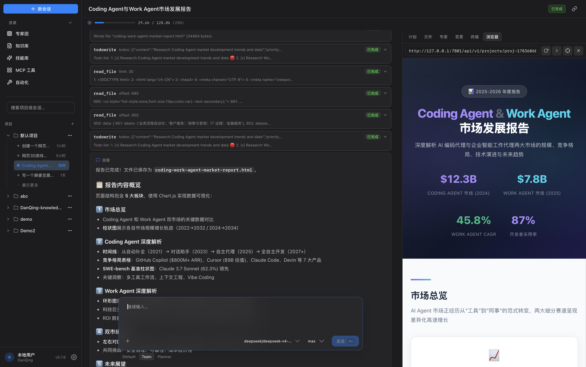
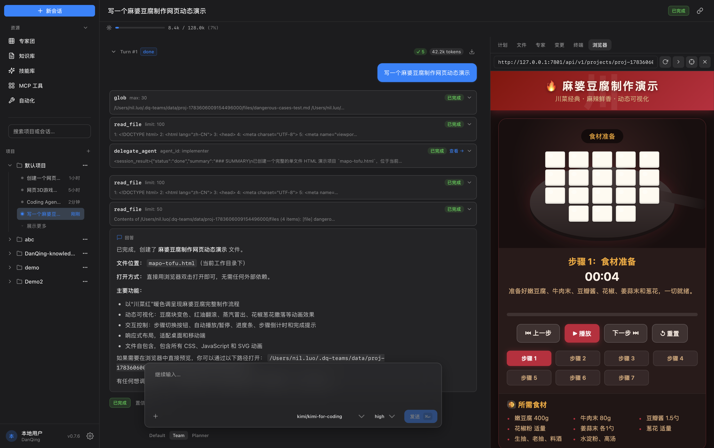
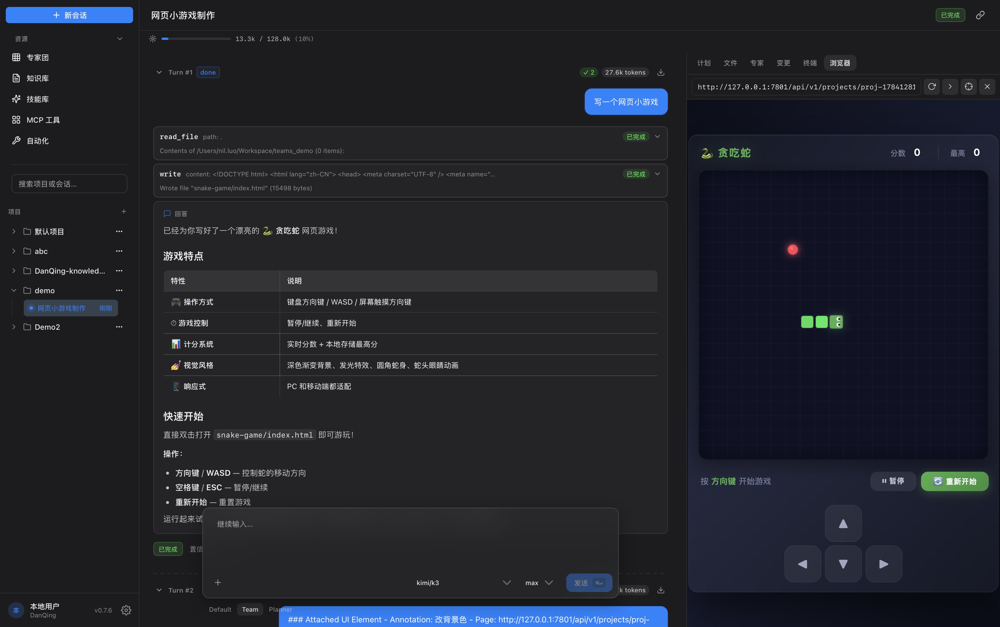

# DanQing Teams

[English](README.md) | [中文](README.zh-CN.md)

[](https://github.com/danqing-ai/danqing-teams/releases/latest)
[](LICENSE)
[](go.mod)

**可自托管的 Agent 工作台**：调研、写代码、跑长任务——类似开源 Cursor 风格的 Agent UI，支持可审计的多智能体委派。

描述目标，实时看 Tool 流，结果在内置浏览器打开。子 Agent 硬隔离上下文、只回传 Report——**不用**手写 LangGraph / CrewAI 流程图。

| 对比 | 常见做法 | DanQing Teams |
|------|----------|---------------|
| **编排** | 你维护 Graph / 角色路由 / 产品 Mode | **LLM 在同一条 Agent Loop 上规划 Tool Call DAG** |
| **子 Agent** | 并行 Session / Handoff 路由 | 同一思维链上的 `delegate_agent`，**硬上下文隔离** |
| **记忆** | 黑盒产品记忆，或另接向量库 | 显式 `memory_*` Tool + 可见 **记忆** Tab（SQLite） |

MIT · Web / 桌面 / CLI / TUI · 支持 Anthropic 与 OpenAI 兼容接口

## 试用

| 平台 | 下载 |
|------|------|
| **macOS**（Apple Silicon） | [`.dmg`](https://github.com/danqing-ai/danqing-teams/releases/latest) |
| **Windows** | [安装包 `.exe`](https://github.com/danqing-ai/danqing-teams/releases/latest) |
| **Linux 服务端** | [`.tar.gz`](https://github.com/danqing-ai/danqing-teams/releases/latest) |

或从源码跑（需同级 [`dq-ui`](https://github.com/danqing-ai/dq-ui)）：

```bash
make dev-web   # → http://localhost:5801/app/
```

在 UI 里填 LLM API Key（或编辑 `~/.dq-teams/config.yaml`）。完整步骤见 [快速开始](#快速开始)。

## 界面一览

三栏工作台：项目侧栏 · Agent 执行日志 · 右侧面板（计划 / 文件 / **记忆** / 变更 / 终端 / 浏览器）。

| 调研报告 | 交互演示 | 网页小游戏 |
|---------|---------|-----------|
|  |  |  |

- **调研报告** — 网页抓取、结构化写作、HTML 实时预览
- **交互演示** — 分步演示，含播放控制
- **网页小游戏** — 生成可玩的贪吃蛇，并通过 UI 标注继续迭代

> 提示：20～30 秒录屏（GIF/MP4）转化远好于静图——有素材后放到 `docs/screenshots/`，链到本表上方即可。

## 设计哲学

### 一切皆工具（Everything is a Tool）

所有能力统一为 Tool 接口，不存在模式区分：

| 传统概念 | 本架构中的统一抽象 |
|---------|------------------|
| Sub-Agent 委派 | `delegate_agent` Tool |
| 用户交互 | `ask_user` Tool |
| 技能 / 能力 | `read_skill` / Skill 绑定 |
| 知识检索 | `search_kb` Tool |
| 持久记忆 | `memory_update` / `memory_read`（user · project · agent） |
| 文件操作 | `read_file` / `write` / `edit` / … |
| 外部 API | `http_request` / MCP / `web_fetch` · `web_search` |

一种抽象（Tool），一种循环（Agent Loop），一种存储（Turn Log）。新能力 = 新 Tool，无层级，无模式。

### 纯 LLM 驱动（Pure LLM-Driven）

LLM 是唯一的决策中心。**没有开发者维护的 Graph、角色路由或 mode 开关**——控制流由模型在同一条 Agent Loop 上生成：

```
用户输入
    ↓
[LLM 解析意图] → 规划 Tool Call DAG
    ↓
逐 Tool 执行（Agent Loop）
    ↓
需要澄清？→ ask_user Tool
    ↓
需要记忆？→ memory_update / memory_read（跨会话，三级作用域）
    ↓
需要委派？→ delegate_agent Tool
      → 新 Turn、干净 Messages（system + goal；不继承父对话）
      → 独立 Tool Registry / Skills / 知识库
      → 子 Agent 跑同一套 Agent Loop
      → 只回传 Report → 父 Agent 继续推理
    ↓
完成 → 交付结果
```

委派不是框架调度器，也不是产品侧的并行模式——它是**同一思维链上的 Tool Call**，并带有**硬上下文隔离**。开发者只提供 Tool 与 Agent 定义，LLM 自主编排。Code 模式和 Work 模式是同一架构在不同参数配置下的自然表现——无需显式 `mode` 参数。

### 长期记忆（Long-term Memory）

跨会话连续性是一等公民 Tool——不是把历史硬塞进 prompt，不是黑盒产品记忆，也不同于会话内压缩。

**机制**

| 环节 | 行为 |
|------|------|
| 写入 | `memory_update(scope, key, content)` — 由模型判断「何时值得记住」 |
| 读取 | `memory_read(scope?, key?, query?)` — 按需检索；**不**每轮自动注入 |
| 作用域 | `user`（全局偏好）· `project`（项目约定 / 决策）· `agent`（角色工作方式） |
| 存储 | SQLite `memories` 表，与 Knowledge、Turn Log 分离 |
| 人机 | 右侧 **记忆** Tab — 浏览、刷新、删除 |

System prompt 中的 `<memory-policy>` 引导模型：记住持久偏好与项目约定；不要记一次性任务、密钥、大段代码、仓库里已有的内容（短暂进度用 `todowrite`）。

**与相近机制的区分**

| 机制 | 职责 |
|------|------|
| Memory 工具 | Agent **主动选择**跨会话保留的事实 |
| Compaction Checkpoint | 上下文截断时的**会话内**摘要 |
| Knowledge（`search_kb`） | **人工**维护、绑定到 Agent 的文档 |

**与主流 AI Agent 的差异**

| 做法 | 常见产品 / 栈 | 问题 | DanQing Teams |
|------|---------------|------|---------------|
| 黑盒产品记忆 | ChatGPT / Claude Memory | 结构、作用域、写入时机对用户不透明 | 显式 Tool + 可见记忆 Tab；带 key 与作用域 |
| IDE / Coding Agent 记忆 | Cursor 类 memory | 常锁在产品内，难审计、难跨端复用 | Web / 桌面 / CLI 共用 SQLite；API 可列表 / 删除 |
| 框架对话缓冲 | LangChain ConversationBuffer / Summary | 偏会话聊天史，不是可复用的项目事实 | 独立 durable 层，三级 `user` / `project` / `agent` |
| 外部向量记忆服务 | Mem0 / Zep 等 | 额外基建；写入策略常在 Agent Loop 之外 | 内置在 Agent Loop 的 Tool；v1 关键词检索，无独立服务 |
| 自动摘要全量索引 | 每轮 / 每段自动记 | 噪声大、有效召回低（我们试过已移除） | 仅模型判定「值得记」时写入 |

主流要么把记忆做成**看不见的产品魔法**，要么做成**再接一套向量库**。DanQing Teams 把记忆留在同一套 Tool 抽象上：模型决策、存储可检视、人通过记忆 Tab 参与。

### 日志即状态（Persistent Execution Trace）

- 每步 Tool Call 的输入、输出、耗时、决策理由完全持久化
- 异常不致命：任意步骤失败可从断点重试
- 完全可回放：执行轨迹可视化浏览
- 人工可纠正：编辑任意 Tool Result，Agent 从该点继续推演

## 与主流框架的根本差异

| 维度 | 主流框架（LangGraph / CrewAI / AutoGen）与典型 Coding Agent | DanQing Teams |
|------|---------|--------|
| **控制流** | 人工维护的 Graph、角色路由或产品 Mode | **纯 LLM 驱动**——无人工维护的流程 |
| **抽象层级** | Agent / Chain / Graph / Role / Mode 多层抽象 | **Tool（唯一抽象）**，极简无层级 |
| **决策中心** | Node / Handoff / 角色调度 | 同一条 Agent Loop 上规划 Tool Call DAG |
| **子 Agent** | 显式创建与路由，或并行 Session / Mode | **同一思维链**上的 `delegate_agent` Tool |
| **上下文** | 常共享或裁剪父对话 | **硬隔离**——子只拿 goal（+可选 context）；父只见 Report |
| **记忆** | 黑盒产品记忆、对话缓冲、或外部向量库 | 显式 `memory_update` / `memory_read` + 作用域存储 + 记忆 Tab |
| **用户交互** | 预设节点 / 审批关卡 | `ask_user` Tool，模型自主决定时机 |
| **状态管理** | 内存为主，可选持久化 | 原生持久化，日志即状态 |
| **调试方式** | 断点 / 外部日志 | 可视化回放，改 Tool Result 继续推演 |
| **人机关系** | 人下指令，机器执行（主从） | 人进入思维流，共同迭代（对等） |

**本质差异**：主流是「开发者（或产品）编排，LLM 执行」；DanQing Teams 是「LLM 在同一思维链上编排；开发者提供能力单元；子 Agent 是带上下文隔离的 Tool Call」。

## 概念模型

```
Project/
  └── Task (长程任务，跨天/周)
        ├── Turn-1  ← 一轮 [输入 → Agent 应答]
        │     ├── Step: LLM 调用 (function calling)
        │     ├── Step: Tool 执行 → 结果注入
        │     └── ...
        ├── Turn-2  ← 用户几天后追问
        ├── ~ Checkpoint 压缩锚点 ~
        └── Turn-N
```

| 概念 | 定义 |
|------|------|
| **Project** | 任务集合，绑定文件系统目录 |
| **Task** | 围绕一个目标的多轮交互，可跨天/周 |
| **Turn** | 一轮 [输入 → Agent 应答]，内含 N 个 LLM Step |
| **Step** | Turn 内一次 LLM 请求+响应，LLM context 原子单位 |
| **委派 Agent** | 委派是 Tool（`delegate_agent`），子 Agent 隔离执行，结果回传父 Turn |
| **ask_user** | 向用户提问也是一个 Tool，暂停等待响应后继续 Agent Loop |
| **Memory** | 跨会话事实：`memory_update` / `memory_read`（作用域 user / project / agent） |

## 架构

```
server/   cli/   tui/    frontend/ (Vue 3 + Vite)
    \       \     /       /
     \       \   /       /
      ---- core/bootstrap ----
              |
  core/service ─── core/runtime ─── core/adapter
       |              |                 |
  core/port ←─────────┘    core/adapter/llm
       |                  (Anthropic / OpenAI 兼容 / Mock)
  core/store/sqlite
  core/store/turnlog
```

| 层 | 目录 | 说明 |
|----|------|------|
| 入口 | `server/` `cli/` `tui/` | HTTP API (Gin) / 命令行 / 终端界面 |
| 前端 | `frontend/` | Vue 3 + Vite |
| 启动 | `core/bootstrap/` | 依赖注入、全局配置组装 |
| 服务 | `core/service/` | Session、Project、Agent、Skill、LLM 配置等 |
| 运行时 | `core/runtime/` | Session/Turn Runner、Prompt、压缩、权限、Tool 执行 |
| 领域 | `core/domain/` | Agent、Session、Project、Skill、Knowledge、Memory、Turn 等 |
| 端口 | `core/port/` | Engine、LLMProvider、Repository、Stream 接口 |
| 适配 | `core/adapter/` | LLM 提供者、配置加载器 |
| 存储 | `core/store/` | SQLite 持久化、Turn Log |

## 前置条件

- Go 1.25+
- Node.js 20+（前端 / 桌面）
- 同级目录的 [`dq-ui`](https://github.com/danqing-ai/dq-ui) 仓库（前端依赖 `file:../../dq-ui/packages/*`）

```text
Workspace/
  DanQing-Teams/
  dq-ui/
```

## 快速开始

```bash
# 与 dq-ui 并列克隆后：
make dev-web          # 后端 :7801 + Vite :5801 → http://localhost:5801/app/
make dev-desktop      # 后端 + Tauri 桌面
make backend          # 纯后端（方便调试器）

make dev-cli          # 命令行（无需 server）
make dev-tui          # 终端界面（无需 server）
make stop             # 停止所有 DQ_DEV 进程
```

首次使用可复制并编辑配置：

```bash
mkdir -p ~/.dq-teams
cp config.example.yaml ~/.dq-teams/config.yaml
# 在 UI 或配置文件中填入 LLM Provider API Key
```

## 构建与打包

```bash
make build-all              # 前端 dist + Go server/cli/tui
make build-go               # 仅三件套 Go 二进制
make pack-macos-desktop     # .dmg / .app
make pack-linux-server      # tar.gz
make pack-windows-desktop   # .exe
make clean                  # 删除 out/
```

### 构建输出

```text
out/
  frontend/dist/     # Vite 生产构建（挂载于 /app/）
  server/            # danqing-teams / danqing-teams-cli / danqing-teams-tui
  desktop/bundle/    # Tauri 安装包
  desktop/cargo/     # Cargo 中间产物
  dist/              # Linux server 发布包
  run/               # 开发用 pid / log / wrappers
```

## 测试

```bash
make test               # 分层检查 + go test ./...
make test-integration   # 集成测试
```

### Harbor Agent 对比（Terminal-Bench 2.0）

官方 **terminal-bench@2.0**（**89** 题）。**题不进 git**，需本机同步到 **`dq-harbor-base:local`**，再用 Harbor + Podman 跑。通过 = Mean reward ≥ 1.0。非榜单提交。

完整步骤：[`evals/dq_harbor/README.md`](evals/dq_harbor/README.md)。成绩：[`evals/dq_harbor/COMPARE_RESULTS.md`](evals/dq_harbor/COMPARE_RESULTS.md)。

```bash
# 依赖：Podman、`uv tool install 'harbor>=0.20'`、LLM 凭证
podman machine start                                    # macOS 如需要
make eval-harbor-base                                   # dq-harbor-base:local
GH_TOKEN=$(gh auth token) make eval-harbor-sync-tb2     # → evals/dq_harbor/tasks/（89 题，gitignore）
make eval-harbor-bin

export TEAMS_MODEL=deepseek/deepseek-v4-flash TEAMS_API_KEY=... TEAMS_BASE_URL=https://api.deepseek.com
make eval-harbor-smoke                                  # 1 题冒烟
# make eval-harbor-suite                                # 全量 89：oracle 再 DanQing
./evals/dq_harbor/compare_agents.sh                     # DanQing / OpenCode / OpenHands
```

## 环境变量

| 变量 | 默认 | 说明 |
|------|------|------|
| `TEAMS_CONFIG` | `~/.dq-teams/config.yaml` | YAML 配置文件路径 |
| `TEAMS_DB_PATH` | `~/.dq-teams/teams.db` | SQLite 数据库 |
| `TEAMS_DATA_DIR` | `~/.dq-teams/data` | 项目与 turn 日志目录 |
| `DQ_BACKEND_PORT` | `7801` | 开发后端端口 |
| `DQ_FRONTEND_PORT` | `5801` | 开发前端端口 |
| `VITE_API_BASE_URL` | `""` | 前端 API 基址（空 = 同源） |

Server、CLI、TUI、桌面端默认共用 `~/.dq-teams/`。首次启动可能从 `~/Library/Application Support/com.danqing.teams/` 或 `./data/teams.db` 迁移已有数据。

### 自定义技能目录

每个 New Turn 会实时扫描以下目录（Agentskills：`skill-name/SKILL.md`），**不写入数据库**，自动并入该 turn 的 `<available_skills>`：

| 路径 | 范围 |
|------|------|
| `~/.agents/skills/` | 用户 |
| `~/.dq-teams/skills/` | 用户 |
| `<项目根>/.agents/skills/` | 项目 |
| `<项目根>/.dq-teams/skills/` | 项目 |

同名技能后者覆盖前者（项目 `.dq-teams` 优先最高）。改磁盘后下一 turn 生效。

## 桌面端（Tauri）

薄壳 + Go sidecar。日常开发：

```bash
make dev-desktop
# 或已有外部后端时：
SKIP_BACKEND=1 make dev-desktop
```

## CI / 发布

`.github/workflows/release.yml` — 推 `v*` tag 或手动 `workflow_dispatch`：

| Job | 产物 |
|-----|------|
| macOS desktop | `out/desktop/bundle/*.dmg`、`*.app` |
| Linux server | `out/dist/danqing-teams-linux-*.tar.gz` |
| Windows desktop | `out/desktop/bundle/*.exe` |

Tag 触发时会将产物附加到 GitHub Release。

## 文档

| 文档 | 说明 |
|------|------|
| [docs/core-design.md](docs/core-design.md) | 核心设计：统一 Agent 架构与引擎 |
| [docs/launch-posts.md](docs/launch-posts.md) | 社区发帖稿（可直接复制） |
| [evals/dq_harbor/README.md](evals/dq_harbor/README.md) | Harbor Terminal-Bench 2.0 评测与 Agent 对比 |
| [AGENTS.md](AGENTS.md) | 贡献者 / Agent 速查 |
| [config.example.yaml](config.example.yaml) | 完整配置参考 |

## 许可证

[MIT](LICENSE)
